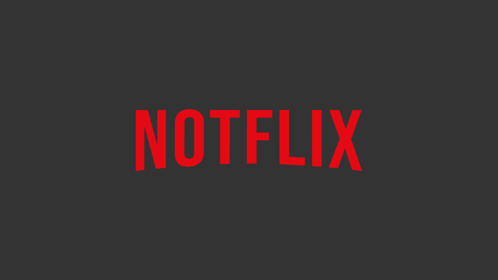

<p align="center">
  
</p>

<h1 align="center"><strong>Notflix</strong></h1>

<p align="center">
  <a href="#about"><strong>About</strong></a> • 
  <a href="#features"><strong>Features</strong></a> • 
  <a href="#demo"><strong>Demo</strong></a> • 
  <a href="#technologies"><strong>Technologies</strong></a> • 
  <a href="#installation"><strong>Installation</strong></a> • 
  <a href="#license"><strong>License</strong></a>
</p>

## <a id="about"></a>**About**

I wanted to try building a faithful front-end creation of Netflix's UI within the MVC (Model-View-Controller) using only Vanilla JavaScript, HTML, and CSS (with the added constraint of achieving the layout using **flexbox only**), implementing architectural patterns suitable for an single-page application (SPA). It's a showcase of a responsive and scalable web application.

### **What I Tried To Focus On**

- **Asynchronous Programming:** Managed asynchronous data fetching with clean error handling and optimized rendering processes.

- **Code Architecture (MVC and Publisher-Subscriber):** Separated code into scalable, self-contained modules using MVC (Model-View-Controller) architecture, and publisher-subscriber pattern.

- **Dynamic Route Handling:** Built a custom routing mechanism to manage various application states and views based on URL changes.

- **Advanced Responsive Design:** Implemented both CSS and JavaScript-based media queries to ensure seamless adaptability across various devices.
- **State Management:** Maintained application state with a focus on performance and clarity.

- **Event Delegation:** User interactions are delegated,using as little event listeners as possible while maintaining readability.
- **ES6+ Features:** Implemented as many modern JS features as possible, while maintaining backwards-compatibility with babel.

- **Animation and Transitions:** Applied CSS animations and transitions for smooth, user-friendly visual effects.

## Features

- **Dynamic Content Browsing**:

  - **Infinite Scrolling**: Seamless infinite scrolling allows users to explore an extensive library of shows and movies without manual pagination.
  - **Category-Specific Pagination**: Each content category has its own pagination system, enabling users to navigate through a large number of titles within a category efficiently.

- **Advanced Search Functionality**:

  - **Dynamic Search Results**: Instant search results are displayed as the user types, with dynamic updates based on API responses.
  - **Search Result Hover Effects**: Rich metadata, including genres, ratings, and descriptions, is shown on hover, enhancing the browsing experience.
  - **Infinite Scrolling in Search**: Continuously load more search results as the user scrolls down, ensuring an uninterrupted browsing experience.

- **Billboard Feature**:

  - **Auto-Playing Videos**: The featured billboard at the top of the page includes an auto-playing video, showcasing the latest or trending content.
  - **Video Controls**: Users can interact with video controls (volume) directly on the billboard.
  - **Dynamic Video Pausing**: The video automatically pauses when the user scrolls it out of view, opens a modal, or engages in another interaction, and resumes when appropriate.

- **Modal and Detail Views**: Detailed information pages for movies and TV shows with additional controls for seasons and episodes.
- **Built-in Browsing:** Title's modal windows act as a built-in browser, where you can navigate by cast member, genre, etc... With a history that works offline, allowing you to navigate back to previous tabs.
- **Responsive Design**: Optimized layout and elements for all screen sizes, from desktops to mobile devices.
- **Performance Optimizations**: Lazy loading, debouncing, and optimized rendering for a fast and efficient user experience.
- **Routing and Navigation**:
  - **Client-Side Routing**: The application includes dynamic client-side routing, allowing users to navigate between different pages (e.g., browsing, title details, search) without full page reloads.
  - **URL Management**: The browser URL dynamically updates to reflect the current state, enabling deep linking and bookmarking of specific views.

## Demo

A live demo of Notflix can be found [here](your-demo-link).

## Technologies

- **JavaScript (ES6+)**: Core scripting language used for logic, data manipulation, and API communication.
- **HTML5/CSS3**: Structure and styling of the web application.
- **Parcel & Babel**: Module bundler & polyfilling.

## Technologies

- 
  **[JavaScript](https://developer.mozilla.org/en-US/docs/Web/JavaScript)**: The core scripting language used for logic, data manipulation, and API communication.

- 
  **[HTML5](https://developer.mozilla.org/en-US/docs/Web/Guide/HTML/HTML5)**: The latest version of HTML used to structure the web application, providing semantic elements for better accessibility and SEO.

- 
  **[CSS3](https://developer.mozilla.org/en-US/docs/Web/CSS)**: Used for styling the web application, including layout designs, animations, and responsive behaviors.

- 
  **[Parcel](https://developer.mozilla.org/en-US/docs/Glossary/Build_tool)**: Web bundler to compile the project into production.

- 
  **[Babel](https://developer.mozilla.org/en-US/docs/Web/JavaScript/Reference/Global_Objects/Proxy)**: To ensure backwards compatibility.

## Learning Outcomes

### 1. **Advanced JavaScript and Front-End Development**

- Implemented a modular architecture using ES6 modules, classes, and modern JavaScript syntax.
- Gained experience with **asynchronous programming** using `async/await` and Promises to handle API requests and dynamic data fetching.
- Developed various **helper functions** for data parsing, string manipulation, and DOM updates, improving code reusability and readability.

### 2. **State Management and Data Flow**

- Managed the state of the application effectively using a **centralized state object**, ensuring that all components have access to the data they need without redundancy.
- Created and updated state dynamically based on user interactions, ensuring that the UI remains consistent with the application state.

### 3. **Responsive and Interactive UI Development**

- Designed a fully **responsive interface** that adapts to different screen sizes and devices, utilizing media queries and dynamic DOM manipulation.
- Built dynamic components like **category sliders, infinite scrolling, and hover effects** to enhance user experience.

### 4. **API Integration and Data Handling**

- Integrated with **The Movie Database (TMDB) API** to fetch dynamic data like movie details, genres, and user recommendations.
- Developed utility functions for handling API errors, parsing data, and formatting movie durations, contributing to a seamless user experience.

### 5. **Performance Optimization Techniques**

- Implemented **event delegation**, using as little event listeners as possible while maintaining readability.
- Implemented **lazy loading** and **infinite scrolling** to improve performance and load times, especially for large data sets.
- Used **debouncing** and **throttling** techniques to optimize event handling and avoid excessive API calls or DOM manipulations.
- Utilized caching strategies to minimize redundant API requests and enhance the speed of content delivery.

### 6. **Error Handling and Debugging**

- Developed robust error-handling mechanisms to manage API errors, unexpected user actions, and network issues.
- Gained experience with debugging tools and techniques to identify and resolve issues efficiently.

### 7. **Version Control and Collaboration**

- Practiced using **Git and GitHub** for version control, branching, and collaborative development.

## Installation

1. Clone the repository:
   ```bash
   git clone https://github.com/yourusername/notflix.git
   ```
2. Navigate to the project directory:
   ```bash
   cd notflix
   ```
3. Install dependencies:
   ```bash
   npm install
   ```
4. Run the development server:
   ```bash
   npm start
   ```

## Contributing

Contributions are welcome! Please open an issue or submit a pull request.

## License

This project is licensed under the MIT License.
